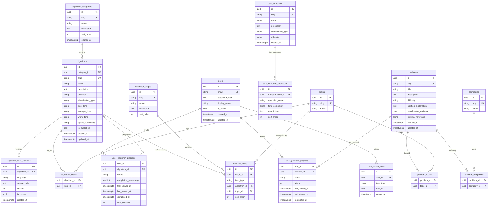

# AlgoVision Database Design

> Companion to `ALGOVISION_BACKEND_PLAN.md` §5 and `ARCHITECTURE.md`.
> This document covers the visual ERD, normalization analysis, index
> catalog, migration sequencing, seed plan, and performance strategy.

---

## 1. Entity-Relationship Diagram



---

## 2. Table Inventory

| #  | Table                       | Purpose                                       | Rows estimate |
|----|-----------------------------|-----------------------------------------------|---------------|
| 1  | users                       | Accounts                                      | 10k           |
| 2  | algorithm_categories        | Top-level groupings                           | <50           |
| 3  | algorithms                  | Catalog of algorithms                         | <200          |
| 4  | algorithm_code_versions     | Source code per language, versioned           | <5k           |
| 5  | topics                      | Reusable tags                                 | <100          |
| 6  | algorithm_topics            | M:N                                           | <2k           |
| 7  | data_structures             | Catalog of data structures                    | <50           |
| 8  | data_structure_operations   | Operations metadata (insert/delete/etc.)      | <500          |
| 9  | problems                    | Interview problems                            | <500          |
| 10 | problem_topics              | M:N                                           | <5k           |
| 11 | companies                   | Companies that ask problems                   | <200          |
| 12 | problem_companies           | M:N                                           | <3k           |
| 13 | user_algorithm_progress     | Per-user progress                             | <2M           |
| 14 | user_problem_progress       | Per-user progress                             | <5M           |
| 15 | user_recent_items           | Last viewed (capped at 50/user)               | <500k         |
| 16 | roadmap_stages              | Roadmap groupings                             | <20           |
| 17 | roadmap_items               | Roadmap entries                               | <500          |

---

## 3. Normalization Analysis

### 3.1 First Normal Form (1NF)

**Requirement:** Atomic values; no repeating groups; primary key.

✅ **All tables comply.** Examples:

- `users.email` is a single string, not a list.
- `algorithm_topics` uses a junction table rather than a comma-separated
  list of topics on `algorithms`.
- `problems` stores description as TEXT (atomic for our purposes; not a
  list of values).

### 3.2 Second Normal Form (2NF)

**Requirement:** 1NF + every non-key column depends on the entire
primary key.

✅ **All tables comply.**

- Composite PKs (`algorithm_topics`, `problem_topics`,
  `problem_companies`, `user_algorithm_progress`,
  `user_problem_progress`) have only the FK columns — no non-key
  attributes depend on only part of the key.

### 3.3 Third Normal Form (3NF)

**Requirement:** 2NF + no transitive dependencies.

✅ **All tables comply.**

- `algorithms.category_id` references `algorithm_categories` rather
  than storing the category name redundantly.
- `problems.difficulty` is a controlled vocabulary (CHECK constraint),
  not free text — no transitive lookup needed.
- Source code lives in `algorithm_code_versions`, not on `algorithms` —
  no multi-valued dependency inside `algorithms`.

### 3.4 BCNF (Boyce-Codd)

**Requirement:** 3NF + every determinant is a candidate key.

✅ **All tables comply.** All non-key dependencies arise from FK
relationships to candidate-key PKs.

### 3.5 Deliberate Denormalization

The schema is fully normalized. No denormalization in v1. If
performance demands it in the future, candidates are:

- `algorithm_categories.name` materialized on `algorithms` (read-heavy
  list endpoint) — defer until measured.
- Dashboard snapshot table — only if aggregation p95 > 300 ms after
  indexes and read replica.

---

## 4. Constraints

### 4.1 Primary Keys

All PKs are `UUID` with `DEFAULT gen_random_uuid()` (PostgreSQL 13+
built-in). UUIDs:

- Avoid leaking row counts via sequential IDs.
- Allow client-generated IDs for offline-first features (future).
- Are safe for distributed inserts.

### 4.2 Foreign Keys & Cascades

| FK relationship                              | ON DELETE     | Reason                                  |
|----------------------------------------------|---------------|-----------------------------------------|
| algorithms.category_id → algorithm_categories| RESTRICT      | Prevent orphaning published algorithms  |
| algorithm_code_versions.algorithm_id         | CASCADE       | Versions are useless without algorithm  |
| algorithm_topics.algorithm_id                | CASCADE       | Junction table, follows parent          |
| algorithm_topics.topic_id                    | CASCADE       | Junction table                          |
| user_algorithm_progress.user_id              | CASCADE       | GDPR right-to-erasure                   |
| user_algorithm_progress.algorithm_id         | CASCADE       | Junction-style                          |
| user_problem_progress.*                      | CASCADE       | Same as above                           |
| user_recent_items.user_id                    | CASCADE       | Same as above                           |
| problem_topics / problem_companies           | CASCADE       | Junction tables                         |
| roadmap_items.stage_id                       | CASCADE       | Items are useless without stage         |
| roadmap_items.algorithm_id                   | SET NULL      | Roadmap entry survives algorithm removal|
| roadmap_items.topic_id                       | SET NULL      | Same                                    |

### 4.3 Check Constraints

``` sql
-- Difficulty
CONSTRAINT algorithms_difficulty_check
    CHECK (difficulty IN ('easy', 'medium', 'hard'))
CONSTRAINT problems_difficulty_check
    CHECK (difficulty IN ('easy', 'medium', 'hard'))
CONSTRAINT data_structures_difficulty_check
    CHECK (difficulty IN ('easy', 'medium', 'hard'))

-- Completion percentage bounds
CONSTRAINT user_algorithm_progress_pct_check
    CHECK (completion_percentage >= 0 AND completion_percentage <= 100)

-- Status vocabularies
CONSTRAINT user_algorithm_progress_status_check
    CHECK (status IN ('not_started', 'in_progress', 'completed'))
CONSTRAINT user_problem_progress_status_check
    CHECK (status IN ('not_started', 'in_progress', 'completed'))

-- Code version uniqueness
UNIQUE (algorithm_id, language, version)

-- Roadmap uniqueness
UNIQUE (stage_id, sort_order)

-- Recent items
CONSTRAINT user_recent_items_type_check
    CHECK (item_type IN ('algorithm', 'data_structure', 'problem'))

-- Roadmap item type
CONSTRAINT roadmap_items_type_check
    CHECK (item_type IN ('algorithm', 'topic'))
CONSTRAINT roadmap_items_target_check
    CHECK (
        (item_type = 'algorithm' AND algorithm_id IS NOT NULL AND topic_id IS NULL) OR
        (item_type = 'topic'     AND topic_id IS NOT NULL     AND algorithm_id IS NULL)
    )
```

### 4.4 Email Uniqueness

``` sql
CREATE UNIQUE INDEX ix_users_email_lower
ON users (LOWER(email));
```

Application normalizes email to lowercase before insert.

---

## 5. Index Catalog

Every index is justified by a real query pattern. **No speculative
indexes.**

| #  | Index                                                    | Query Pattern                                       | Selectivity | Write Cost |
|----|----------------------------------------------------------|-----------------------------------------------------|-------------|------------|
| 1  | `ix_users_email_lower` (UNIQUE, LOWER(email))            | Login, registration                                 | Very high   | Low        |
| 2  | `ix_algorithms_slug` (UNIQUE)                            | `get_by_slug`                                       | Very high   | Low        |
| 3  | `ix_algorithms_category_id`                              | Filter by category                                  | Medium      | Low        |
| 4  | `ix_algorithms_difficulty`                               | Filter by difficulty                                | Medium      | Low        |
| 5  | `ix_algorithms_is_published`                             | `WHERE is_published = true` (most queries)          | Very high   | Low        |
| 6  | `ix_algorithms_updated_at`                               | ETag support                                        | High        | Low        |
| 7  | `ix_algorithm_code_versions_algo_lang`                   | Get current code for `(algo, lang)`                 | Very high   | Low        |
| 8  | `ix_topics_slug` (UNIQUE)                                | Filter by topic                                     | Very high   | Low        |
| 9  | `ix_algorithm_topics_topic_id`                           | Reverse lookup: algorithms for topic               | High        | Medium     |
| 10 | `ix_problems_slug` (UNIQUE)                              | `get_by_slug`                                       | Very high   | Low        |
| 11 | `ix_problems_difficulty`                                 | Filter                                               | Medium      | Low        |
| 12 | `ix_problem_companies_company_id`                        | Reverse: problems per company                       | High        | Medium     |
| 13 | `ix_problem_topics_topic_id`                             | Reverse: problems per topic                         | High        | Medium     |
| 14 | `ix_user_algorithm_progress_user_id`                     | Dashboard counts, per-user progress list            | High        | Medium     |
| 15 | `ix_user_algorithm_progress_algo_id`                     | Cross-user analytics (admin; future)               | High        | Medium     |
| 16 | `ix_user_problem_progress_user_id`                       | Dashboard, per-user list                            | High        | Medium     |
| 17 | `ix_user_problem_problem_id`                             | Cross-user analytics (admin; future)               | High        | Medium     |
| 18 | `ix_user_recent_items_user_viewed` `(user_id, viewed_at DESC)` | "Recently viewed" sidebar               | Very high   | Medium     |
| 19 | `ix_roadmap_items_stage_id`                              | Roadmap page                                        | Very high   | Low        |

**Composite indexes** are preferred when both columns always appear
together in queries:

- `ix_user_recent_items_user_viewed` covers the dashboard query and
  the "last 50 per user" pruning.

**Future indexes** (when traffic warrants, not before):

- `pg_trgm` GIN indexes on `algorithms.name` and `problems.title` for
  substring search when scaling requires it.
- `tsvector` column on `problems.description` for full-text search.

---

## 6. Migration Plan (Ordered)

Migrations are ordered to respect FK dependencies. Each migration is
reversible where practical.

``` text
0001_init_extensions
  CREATE EXTENSION IF NOT EXISTS "pgcrypto";   -- gen_random_uuid()
  CREATE EXTENSION IF NOT EXISTS "citext";     -- case-insensitive text

0002_create_users
  users table + email unique index

0003_create_topics
  topics table

0004_create_algorithm_categories
  algorithm_categories table

0005_create_algorithms
  algorithms table + indexes (category, difficulty, is_published,
  updated_at)

0006_create_algorithm_code_versions
  algorithm_code_versions table + unique index

0007_create_algorithm_topics
  M:N table

0008_create_data_structures
  data_structures table

0009_create_data_structure_operations
  data_structure_operations table

0010_create_companies
  companies table

0011_create_problems
  problems table + indexes

0012_create_problem_topics
  M:N table

0013_create_problem_companies
  M:N table

0014_create_user_algorithm_progress
  user_algorithm_progress table + composite PK + indexes

0015_create_user_problem_progress
  user_problem_progress table + composite PK + indexes

0016_create_user_recent_items
  user_recent_items table + index (user_id, viewed_at DESC)

0017_create_roadmap_stages
  roadmap_stages table

0018_create_roadmap_items
  roadmap_items table + unique (stage_id, sort_order)

9999_seed_data
  Idempotent seed: categories, topics, algorithms, problems,
  companies, roadmap stages.
  (Seeds run separately from migrations in CI.)
```

### Migration Discipline

1. Every schema change → new migration file. Never edit applied
   migrations.
2. Each migration has both `upgrade()` and `downgrade()` (downgrade
   may be `pass` for irreversible data migrations).
3. CI verifies `alembic upgrade head` against ephemeral PostgreSQL.
4. CI verifies downgrade where defined.
5. Migrations are reviewed for: missing indexes, missing FK
   constraints, missing CHECK constraints, missing `NOT NULL`.

---

## 7. Seed Plan

### 7.1 What Gets Seeded

| Entity                    | Count | Source                                    |
|---------------------------|-------|-------------------------------------------|
| algorithm_categories      | 8     | Hardcoded list (sorting, searching, etc.) |
| topics                    | 30    | Hardcoded list (array, hash-map, etc.)    |
| algorithms                | ~42   | Hardcoded list with metadata + complexity |
| algorithm_code_versions   | ~126  | 3 languages × ~42 algorithms (v1)         |
| data_structures           | 12    | Hardcoded list                            |
| data_structure_operations | ~60   | Hardcoded per data_structure              |
| problems                  | ~50   | Hardcoded with descriptions               |
| companies                 | 10    | Google, Meta, Amazon, etc.                |
| problem_companies         | ~150  | M:N assignments                           |
| problem_topics            | ~150  | M:N assignments                           |
| roadmap_stages            | 5     | Foundations → Advanced                    |
| roadmap_items             | ~80   | Hardcoded                                 |
| users                     | 0     | None (registration only)                  |

### 7.2 Idempotency

All seed scripts must be safe to run twice. Strategies:

- Use `ON CONFLICT (slug) DO NOTHING` for inserts.
- Use deterministic UUIDs (not `gen_random_uuid()`) so re-runs are
  idempotent without conflict resolution.

### 7.3 Seed File Layout

``` text
src/seeds/
  __init__.py
  categories.py
  topics.py
  algorithms.py
  data_structures.py
  problems.py
  companies.py
  roadmap.py
  runner.py            # orchestrates seeds in dependency order
```

``` bash
# Run
python -m src.seeds.runner
```

---

## 8. Query Patterns & Performance

### 8.1 Critical Queries

**Q1: List published algorithms with category + topics, paginated,
filtered.**

``` sql
SELECT a.id, a.slug, a.name, a.description, a.difficulty,
       a.visualization_type, a.best_time, a.average_time,
       a.worst_time, a.space_complexity,
       c.slug AS category_slug, c.name AS category_name,
       COALESCE(
           (SELECT json_agg(json_build_object('slug', t.slug, 'name', t.name))
            FROM algorithm_topics at
            JOIN topics t ON t.id = at.topic_id
            WHERE at.algorithm_id = a.id),
           '[]'::json
       ) AS topics
FROM algorithms a
JOIN algorithm_categories c ON c.id = a.category_id
WHERE a.is_published = true
  AND ($category IS NULL OR c.slug = $category)
  AND ($difficulty IS NULL OR a.difficulty = $difficulty)
  AND ($search IS NULL OR a.name ILIKE '%' || $search || '%')
ORDER BY a.name
LIMIT $page_size OFFSET $offset;
```

Expected: <50 ms with indexes on `category_id`, `difficulty`,
`is_published`.

**Q2: Dashboard aggregation for a user.**

``` sql
-- Algorithms learned / total
SELECT
    COUNT(*) FILTER (WHERE uap.status = 'completed') AS algorithms_learned,
    (SELECT COUNT(*) FROM algorithms WHERE is_published) AS algorithms_total
FROM user_algorithm_progress uap
WHERE uap.user_id = $user_id;

-- Problems solved
SELECT COUNT(*) FROM user_problem_progress
WHERE user_id = $user_id AND status = 'completed';

-- Current streak: consecutive days with at least one completion
SELECT DISTINCT date_trunc('day', completed_at) AS d
FROM user_algorithm_progress
WHERE user_id = $user_id AND completed_at IS NOT NULL
UNION
SELECT DISTINCT date_trunc('day', completed_at)
FROM user_problem_progress
WHERE user_id = $user_id AND completed_at IS NOT NULL
ORDER BY d DESC;

-- Recently viewed (capped at 50)
SELECT item_type, item_id, viewed_at
FROM user_recent_items
WHERE user_id = $user_id
ORDER BY viewed_at DESC
LIMIT 50;
```

Expected: <200 ms p95 with indexes on `user_id`, `completed_at`.

### 8.2 Performance Targets

| Endpoint                           | p50   | p95   |
|------------------------------------|-------|-------|
| GET /algorithms                    | 30 ms | 80 ms |
| GET /algorithms/{slug}              | 20 ms | 50 ms |
| GET /problems (with filters)        | 50 ms | 120 ms|
| GET /dashboard                      | 100 ms| 300 ms|
| POST /progress/algorithms/{id}      | 30 ms | 80 ms |
| GET /roadmap                        | 20 ms | 50 ms |

### 8.3 Load Test Plan

Use `k6` or `locust` with realistic traffic:

``` text
Smoke test:
  100 RPS, 1 minute, /algorithms list
  → expect p95 < 100 ms

Soak test:
  50 RPS sustained, 10 minutes, mixed endpoints
  → expect no memory growth, p95 stable

Dashboard stress:
  500 users × /dashboard in parallel
  → expect p95 < 400 ms with 1000 progress rows per user
```

### 8.4 Connection Pooling

- asyncpg pool size: 10 per uvicorn worker × 4 workers = 40 connections
  max.
- PostgreSQL `max_connections` set to 100 (room for migrations,
  monitoring).

---

## 9. Backup & Recovery

| Aspect           | Policy                                              |
|------------------|-----------------------------------------------------|
| Frequency        | Daily automated snapshots; PITR enabled             |
| Retention        | 30 days point-in-time, 12 months daily              |
| Encryption       | At-rest (managed PG encryption); TLS in transit     |
| Testing          | Quarterly restore drill into staging                |
| GDPR             | Account deletion cascades to all user_*, anonymizes email |

---

## 10. Open Questions

- **Read replica** for `/dashboard` aggregation. Defer until traffic
  justifies.
- **pgvector** for "similar algorithms" recommendations (future).
- **Partitioning** of `user_algorithm_progress` and
  `user_problem_progress` by `user_id` hash if row counts exceed 10M.
  Defer.

---

## 11. References

- Architecture: `ARCHITECTURE.md`
- Backend plan: `ALGOVISION_BACKEND_PLAN.md`
- Backend contract: `AlgoVision_BACKEND.md` §8-24
- Frontend plan: `ALGOVISION_FRONTEND_PLAN.md`